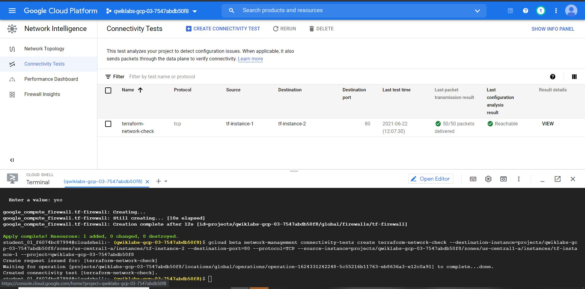

<h1 align='center'>Automating Infrastructure on Google Cloud with Terraform: Challenge Lab</h1>

<h2> Steps </h2>

1. [Create the configuration files](#1)
1. [Import infrastructure](#2)
1. [Configure a remote backend](#3)
1. [Modify and update infrastructure](#4)
1. [Taint and destroy resources](#5)
1. [Use a module from the Registry](#6)
1. [Configure a firewall](#7)
1. [(Optitional) Connectivity test](#8)

Here are the [configuration files](../../blob/main/Automating%20Infrastructure%20(Terraform)/).

<h3 id=1>Create the configuration files</h3>

* Create the directory and configuration files as required.
```
touch main.tf variables.tf
mkdir modules && cd modules
mkdir instances && cd instances
touch instances.tf outputs.tf variables.tf
cd ..
mkdir storage && cd storage
touch storage.tf outputs.tf variables.tf
```

* Fill out the [`variables.tf`](../../blob/main/Automating%20Infrastructure%20(Terraform)/variables.tf) and [`main.tf`](../../blob/main/Automating%20Infrastructure%20(Terraform)/main.tf) ([More details...](https://learn.hashicorp.com/tutorials/terraform/google-cloud-platform-build))
* Initialize Terraform
```
cd ~
terraform init
```

<h3 id=2>Import infrastructure</h3>

  Get detailed information of the instances.
  > gcloud compute instances describe INSTANCE_NAME [--zone=ZONE] 

* Write the resource configuration([instances.tf](../../blob/main/Automating%20Infrastructure%20(Terraform)/modules/instances/instances.tf)) to match the existed instances. I also configured the [`variables.tf`](../../blob/main/Automating%20Infrastructure%20(Terraform)/modules/instances/variables.tf) file.
* Ues command `terraform import` ([the details about this command](https://www.terraform.io/docs/extend/resources/import.html)) to import configurations into the `instances` module
```
export Instance1_ID=$(gcloud compute instances describe tf-instance-1 --zone=us-central1-a --format="value(id)")
terraform import  module.instances.google_compute_instance.tf-instance-1 $Instance1_ID
```
```
export Instance2_ID=$(gcloud compute instances describe tf-instance-2 --zone=us-central1-a --format="value(id)")
terraform import module.instances.google_compute_instance.tf-instance-2 $Instance2_ID
```

* Apply changes
```
terraform plan
terraform apply
```
<h3 id=3>Configure a remote backend</h3>

* Create a bucket inside the `storage` moudle. ([`storage.tf`](../../blob/main/Automating%20Infrastructure%20(Terraform)/modules/storage/storage.tf)). I also configured the [variables.tf](../../blob/main/Automating%20Infrastructure%20(Terraform)/modules/storage/variables.tf) file.
* Add the moudle reference to the [`main.tf`](../../blob/main/Automating%20Infrastructure%20(Terraform)/main.tf).
* Initialize the module and apply the changes.
```
terraform init
terraform apply
```
* Use the prefix `terraform/state` to configure the bucket as the [remote backend](https://www.terraform.io/docs/language/settings/backends/gcs.html)
* Initialize the module.
```
terraform init
```

<h3 id=4>Modify and update infrastructure</h3>

* Modify the  machine_type (*n1-standard-1*->*n1-standard-2*) and add a third instance resource named `tf-instance-3`.
* Initialize the module and apply the changes.
```
terraform init
terraform apply
```
<h3 id=5>Taint and destroy resources</h3>

* Taint the `tf-instance-3` and apply the changes.
```
terraform taint module.instances.google_compute_instance.tf-instance-3
terraform plan
terraform apply
```
* <strong>Delete the resource</strong> in `main.tf` to destory the instance `tf-instance-3`
```
terraform apply
```

<h3 id=6>Use a module from the Registry</h3>

* Add [Network Module](https://registry.terraform.io/modules/terraform-google-modules/network/google/3.2.2) to the [`main.tf`](../../blob/main/Automating%20Infrastructure%20(Terraform)/main.tf) file. 
* Initialize the module and apply the changes.
```
terraform init
terraform apply
```
* Navigate to the instances module and connect `tf-instance-1` to `subnet-01`, `tf-instance-2` to `subnet-02`. ([instances.tf](../../blob/main/Automating%20Infrastructure%20(Terraform)/modules/instances/instances.tf))
* Initialize the module and apply the changes.
```
terraform init
terraform apply
```

  
<h3 id=7>Configure a <a href="https://registry.terraform.io/providers/hashicorp/google/latest/docs/resources/compute_firewall">firewall</a></h3>

* Create a firewall rule named *tf-firewall* in the [`main.tf`](../../blob/main/Automating%20Infrastructure%20(Terraform)/main.tf).
  
  To retrieve the network argument
  > ID - an identifier for the resource with format
  > 
  > `projects/{{project}}/global/networks/{{name}}`
  > 
  > self_link - The URI of the created resource.
* Initialize the module and apply the changes.
```
terraform init
terraform apply
```


<h3 id=8>(Optitional) Connectivity test</h3>

```
gcloud beta network-management connectivity-tests create terraform-network-check \
--destination-instance=projects/<FILL IN YOUR PROJECT ID HERE>/zones/us-central1-a/instances/tf-instance-2 \
--source-instance=projects/<FILL IN YOUR PROJECT ID HERE>/zones/us-central1-a/instances/tf-instance-1 \
--project=<FILL IN YOUR PROJECT ID HERE> \
--destination-port=80 \
--protocol=TCP 
```

