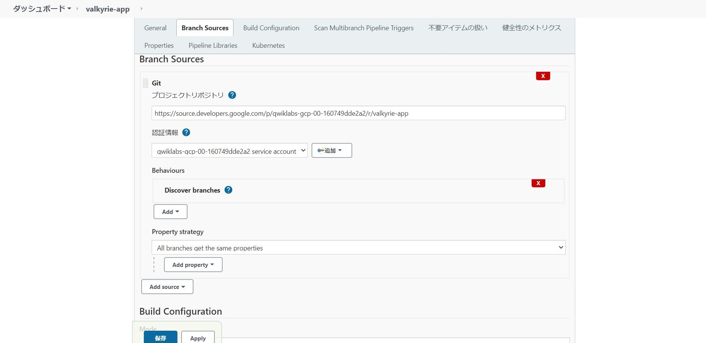
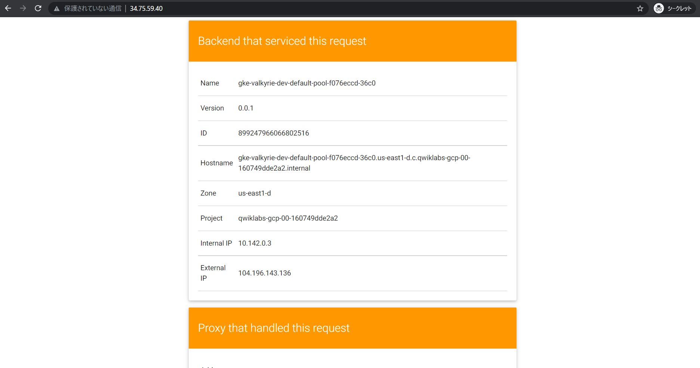

<h1 align='center'>Deploy to Kubernetes in Google Cloud: Challenge Lab</h1>

<strong>Note: Make sure the region is `us-east1` and the zone is `us-east1-b`</strong>

<h2> Steps </h2>

1. [Create a Docker image and store the Dockerfile](#1)
1. [Test the created Docker image](#2)
1. [Push the Docker image in the Container Repository](#3)
1. [Create and expose a deployment in Kubernetes](#4)
1. [Update the deployment with a new version of valkyrie-app](#5)
1. [Create a pipeline in Jenkins to deploy your app](#6)

<h3 id=1>Create a Docker image and store the Dockerfile</h3>

Each Google Project has zero or more git repositories that were associated with it.
> gcloud source repos list

Clones a git repository from current Google Cloud project into the specified directory.
> gcloud source repos clone REPOSITORY_NAME [DIRECTORY_NAME]

* Clone the valkyrie-app source code repository
```
source <(gsutil cat gs://cloud-training/gsp318/marking/setup_marking.sh)
export PROJECT_ID=$(gcloud info --format='value(config.project)')
gcloud source repos clone valkyrie-app --project=$PROJECT_ID
```

* Create a `Dockerfile`
```
cd valkyrie-app/
cat > Dockerfile <<EOF
FROM golang:1.10
WORKDIR /go/src/app
COPY source .
RUN go install -v
ENTRYPOINT ["app","-single=true","-port=8080"]
EOF
```

* To build and tag the image `valkyrie-app` with `v0.0.1`.
```
docker build -t valkyrie-app:v0.0.1 .
```

* Don't forget to run the `step1.sh` to check your work. 
```
cd ..
./step1.sh
```

<h3 id=2>Test the created Docker image</h3>

* Map the host’s port 8080 to port 8080 on the container
> --publish , -p		Publish a container's port(s) to the host
>
>  Add & to the end of the command to cause the container to run in the background.

```
docker run -p 8080:8080 valkyrie-app:v0.0.1 &
```


* Don't forget to run the `step2.sh` to check your work. 
```
./step2.sh
```

<h3 id=3>Push the Docker image in the Container Repository</h3>

* Push images to private registry hosted by gcr, it is necessary to [tag the images with a registry name](https://cloud.google.com/container-registry/docs/pushing-and-pulling#tag).

```
cd valkyrie-app
docker tag valkyrie-app:v0.0.1 gcr.io/$PROJECT_ID/valkyrie-app:v0.0.1
```

* Push this Docker image into Container Repository.
```
docker push gcr.io/$PROJECT_ID/valkyrie-app:v0.0.1
```

<h3 id=4>Create and expose a deployment in Kubernetes</h3>

* Modify the `deployment.yaml`, replace `IMAGE_HERE` with the following command
```
sed -i s#IMAGE_HERE#gcr.io/$PROJECT_ID/valkyrie-app:v0.0.1#g k8s/deployment.yaml
```

* Don't forget to check the Kubernetes credentials before deploying the image onto the Kubernetes cluster.

  I forgot it... and the zone is `us-east1-d` here.
```
gcloud container clusters get-credentials valkyrie-dev --zone us-east1-d
```

* Deploy `deployment.yaml` and `service.yaml`.
```
kubectl create -f k8s/deployment.yaml
kubectl create -f k8s/service.yaml
```

<h3 id=5>Update the deployment with a new version of valkyrie-app</h3>

* Merge `kurt-dev` into master
```
git merge origin/kurt-dev
```

* Modify the `development.yaml`, replace replicas 1 with 3.
```
kubectl edit deployment valkyrie-dev
```

* Build a new version and push the updated image to the Container Repository
```
docker build -t gcr.io/$PROJECT_ID/valkyrie-app:v0.0.2 .
docker push gcr.io/$PROJECT_ID/valkyrie-app:v0.0.2
```

* [Rolling update](../../../GCP_Notes/blob/main/blue-green%20deployment%2C%20rolling%20update%20and%20canary%20deployment.md), replace the version `v0.0.1` by `v0.0.2`
```
kubectl edit deployment valkyrie-dev
```
<h3 id=6>Create a pipeline in Jenkins to deploy your app</h3>

<strong>If you are not familiar with the contents here, please read *[Continuous Delivery with Jenkins in Kubernetes Engine](https://google.qwiklabs.com/focuses/1104?parent=catalog)* again!</strong>

* Kill the running container
```
docker ps
docker kill [CONTAINER ID]
```

* Get the password
```
printf $(kubectl get secret cd-jenkins -o jsonpath="{.data.jenkins-admin-password}" | base64 --decode);echo
```

* Connect to the Jenkins console
```
export POD_NAME=$(kubectl get pods --namespace default -l "app.kubernetes.io/component=jenkins-master"-l "app.kubernetes.io/instance=cd" -o jsonpath="{.items[0].metadata.name}")
kubectl port-forward $POD_NAME 8080:8080 >> /dev/null &
```

* Setup your credentials to use `Google Service Account from metadata`.

* Create a pipeline job that points to your \*/master branch. 
  
  You can get the git project repository URL by running `gcloud source repos list`. The result is as follows:
> https://source.developers.google.com/p/[PROJECT_ID]/r/valkyrie-app




* Edit Jenkinsfile, replace `YOUR_PROJECT` with YOUR ACTUAL PROJECT ID
* Edit html.go and change green to organge
* Use `git` to add and commit these changes to the master branch. Push to the  repository.
```
git config --global user.email "student-02-42363f1062b0@qwiklabs.net"
git config --global user.name "linechen"
git add .
git commit -m "new version-color changes"
git push origin master
```



以上です。
