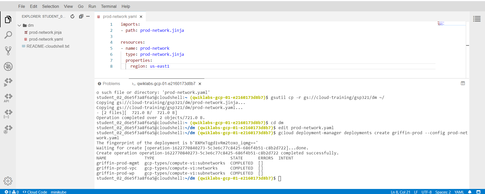
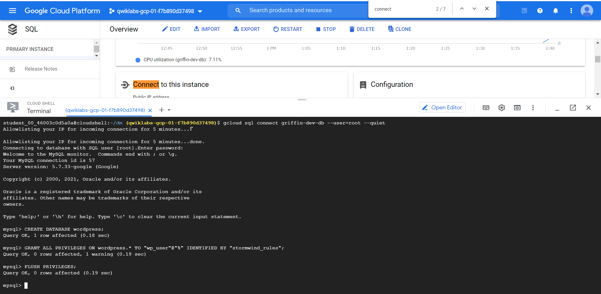

<h1 align='center'> Set Up and Configure a Cloud Environment in Google Cloud: Challenge Lab </h1>

<strong>Note: Make sure the region is `us-east1` and the zone is `us-east-1`</strong>

<h2> Steps </h2>

1. [Create development VPC manually](#1)
1. [Create production VPC using Deployment Manager](#2)
1. [Create bastion host](#3)
1. [Create and configure Cloud SQL Instance](#4)
1. [Create Kubernetes cluster](#5)
1. [Prepare the Kubernetes cluster](#6)
1. [Create a WordPress deployment](#7)
1. [Enable monitoring](#8)
1. [Provide access for an additional engineer](#9)<br>
 

<h3 id=1>Create development VPC manually</h3>

* Create a VPC called `griffin-dev-vpc` with **Custom** mode
```
gcloud compute networks create griffin-dev-vpc \
    --subnet-mode=custom \
```
* Create a subnet  called `griffin-dev-wp` and set the IP address range as `192.168.16.0/20`
```
gcloud compute networks subnets create griffin-dev-wp \
    --network=griffin-dev-vpc \
    --range=192.168.16.0/20 \
    --region=us-east1
```
* Create a subnet  called `griffin-dev-mgmt` and set the IP address range as `192.168.32.0/20`
```
gcloud compute networks subnets create griffin-dev-mgmt \
    --network=griffin-dev-vpc \
    --range=192.168.32.0/20 \
    --region=us-east1
```

<h3 id=2>Create production VPC using Deployment Manager</h3>

* Copy the Deployment Manager configuration files
```
gsutil cp -r gs://cloud-training/gsp321/dm ~/
```

* Edit the `prod-network.yaml` file
```
cd dm
edit prod-network.yaml
```
* Set `SET_REGION` as `us-east1` in the file and save the change.
* Create the VPC network with the mentioned configuration file
```
gcloud deployment-manager deployments create griffin-prod --config prod-network.yaml
```


<h3 id=3>Create bastion host</h3>

[what is bastion host](https://cloud.google.com/solutions/connecting-securely#bastion)
```
gcloud compute instances create griffin-dev-db \
--region=us-east1 \
--tags=bastion \
--network-interface=griffin-dev-mgmt,griffin-dev-mgmt
```
* Create firewall rules
```
gcloud compute firewall-rules create allow-bastion-dev-ssh \
    --network griffin-dev-vpc \
    --action allow \
    --target-tags bastion \
    --source-ranges 192.168.32.0/20 \
    --rules tcp:22
```
```
gcloud compute firewall-rules create allow-bastion-prod-ssh \
    --network griffin-prod-vpc \
    --action allow \
    --target-tags bastion \
    --source-ranges 192.168.48.0/20 \
    --rules tcp:22
```
<h3 id=4>Create and configure Cloud SQL Instance</h3>

* Create a cloud SQL instance
```
gcloud sql instances create griffin-dev-db \
 --region=us-east1 
```
* Set a password
```
gcloud sql users set-password root --host=% --instance griffin-dev-db --password admin
```
* Connect to this instance
```
gcloud sql connect griffin-dev-db --user=root --quiet
```
* Input the password you set just now
* Prepare the WordPress environment
```
CREATE DATABASE wordpress;
GRANT ALL PRIVILEGES ON wordpress.* TO "wp_user"@"%" IDENTIFIED BY "stormwind_rules";
FLUSH PRIVILEGES;
```
* Exit
```
exit
```



<h3 id=5>Create Kubernetes cluster</h3>

```
gcloud container clusters create griffin-dev \
   --zone us-east1-b \
   --num-nodes=2 \
   --machine-type=n1-standard-4 \
   --network=griffin-dev-vpc \
   --subnetwork=griffin-dev-wp
```
<h3 id=6>Prepare the Kubernetes cluster</h3>
<h3 id=7>Create a WordPress deployment</h3>
<h3 id=8>Enable monitoring</h3>
<h3 id=9>Provide access for an additional engineer</h3>

